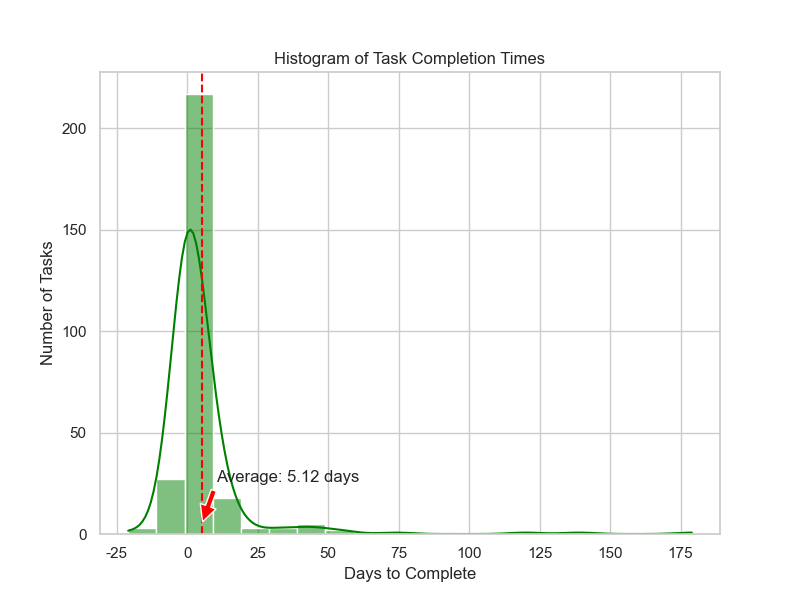
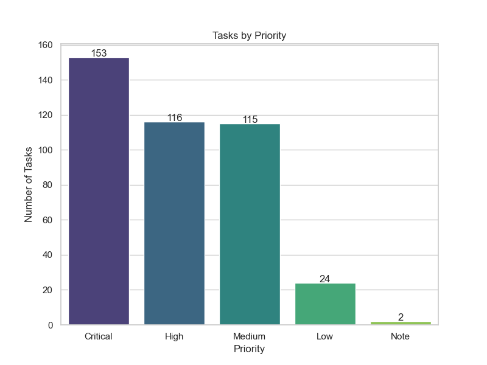

# Notion Database Integration and Automation


The main goal of this project is to analyze your work on Notion to provide useful insights for better productivity. It fetches data from your Notion database, including pages and content, and generates reports with charts to help you visualize your tasks.

At the first run, it might take a while to fetch all the data depending on the amount of pages you have, but later runs will only fetch the newly updated pages. This code is currently designed to **not** affect your existing Notion database by avoiding operations like 'insert' or 'update'. Future updates to this repository might include those operations, but they will be clearly documented.


**Disclaimer:** Use this code at your own risk. The author is not responsible for any unintended consequences resulting from its use.

---

## Table of Contents

- [Features](#features)
- [Requirements](#requirements)
- [Configuration Setup](#configuration-setup)
- [Installation](#installation)
- [Running](#running)
- [Usage](#usage)
- [Notion Database Assumptions](#notion-database-assumptions)
- [Notes](#notes)
- [Contributing](#contributing)
- [License](#license)


---

## Features

- Fetch Notion database and pages
- Download attached files
- Export data to CSV and JSON
- Analyze tasks and generate reports with charts
- Designed to avoid altering your Notion database (read-only operations)

---

## Requirements
- Python 3.6 or higher
- Notion API token with read permissions and a Notion database ID

---

## Configuration Setup

For added security, create a `secret.py` file and add the following variables, which will be imported into `globals.py`:
1. `NOTION_API_TOKEN`: Add your Notion API token.
2. `NOTION_DATABASE_ID`: Add your Notion database ID.
3. `PAGES_CSV_FILE_NAME`: Add the name of the generated CSV file for your Notion pages.
4. `PAGES_JSON_FILE_NAME`: Add the name of the generated JSON file for your Notion pages.

### Example of `secret.py`:
```python
NOTION_API_TOKEN = "your-notion-api-token"
NOTION_DATABASE_ID = "your-notion-database-id"
PAGES_CSV_FILE_NAME = "notion_pages.csv"
PAGES_JSON_FILE_NAME = "notion_pages.json"
```

---

## Installation
Add the necessary Python libraries by running the following command (It is recommended to create a Python virtual environment):
### (Optional) Create a virtual environment:
    python -m venv notion
### (Optional) Activate it in Windows:
    .\notion\Scripts\activate
### (Optional) Activate it in Linux:
    source notion/bin/activate
### (Required) Install the requirements:
    pip install -r requirements.txt

## Running
After adding your configuration values and installing the requirements, simply run as:
```python
python app.py
```

---

## Usage
You can use a script to automate the whole process of running.
First, changing the path in either `.bat` or `.sh` depending on system. Then, double-click on it and wait.


After running the script, you will receive reports like the following:




---


## Notion Database Assumptions
The assumption of a Notion database is to have the following columns:
1. ID: Named UID in the code
2. NID: As type 'ID' with the prefix 'PDM' which shows the numeric ID e.g. '454'.
3. Name: As type 'title'.
4. Status: As type 'select' with the options: '6 Done 🙌', '5 Paused', '4 Doing', '3 To Do', '2 Notes', and '1 Canceled'.
5. Started: As type 'date'.
6. Completed: As type 'date'.
7. Due: As type 'date'.
8. Update Time: As type 'Last edited time'.
9. Priority: As type 'select' with the options: 'Critical', 'High', 'Medium', 'Low', and 'Note'.
10. Files & media: As type 'Files & media'.
11. Created: As type 'Created time'.
12. Parent item: As type 'Relation'.
13. Sub-item: As type 'Relation'.

Body Content: This is not part of the database, but it represents the content of a page in the database.

---

## Notes
- **Permissions:** Ensure the `NOTION_API_TOKEN` has appropriate permissions for accessing the database.
- **Database Structure:** Verify that your Notion database matches the column structure outlined above, or edit the code to math your structure.
- **Data Usage:** Use the generated CSV and JSON files for further processing or reporting.
- **Troubleshooting:** If you encounter issues with data fetching, check your internet connection and API token validity.

---

## Contributing
Contributions are welcome! Please open an issue or submit a pull request.

---

## License

This project is licensed under the MIT License - see the [LICENSE](extras/LICENSE) file for details.
